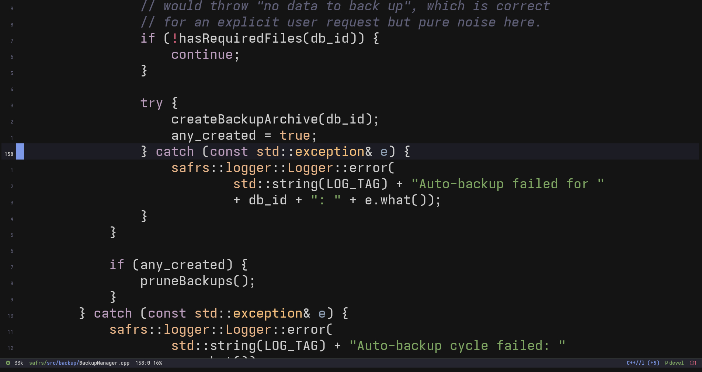
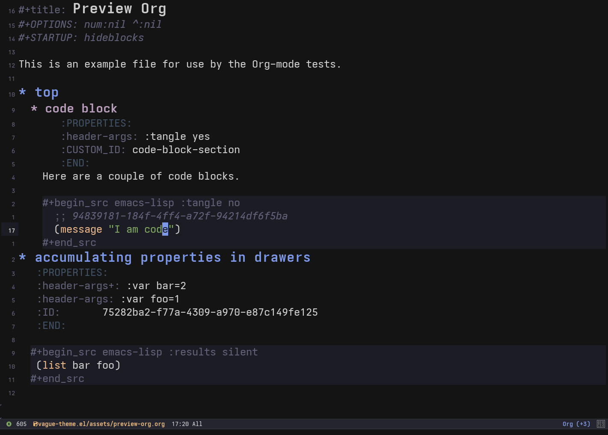

# vague.el

A muted, low-contrast dark theme for Emacs. Built around a hand-picked palette of desaturated blues, warm ambers, and dusty purples — easy on the eyes for long sessions.

Works in vanilla Emacs (28+) and Doom Emacs.

## Screenshots




## Installation

### Manual

Clone the repo and add the directory to your `custom-theme-load-path`:

```emacs-lisp
(add-to-list 'custom-theme-load-path "~/.emacs.d/themes/vague.el")
(load-theme 'vague t)
```

### straight.el

```emacs-lisp
(straight-use-package
 '(vague-theme :type git :host github :repo "vague-theme/vague.el"))
(load-theme 'vague t)
```

### use-package + straight.el

```emacs-lisp
(use-package vague-theme
  :straight (:host github :repo "vague-theme/vague.el")
  :config (load-theme 'vague t))
```

### Doom Emacs

In `packages.el`:

```emacs-lisp
(package! vague-theme
  :recipe (:host github :repo "vague-theme/vague.el"))
```

In `config.el`:

```emacs-lisp
(setq doom-theme 'vague)
```

## Palette

| Name       | Hex       | Role                          |
|------------|-----------|-------------------------------|
| `black`    | `#141415` | Default background            |
| `shadow`   | `#1c1c24` | Secondary background, hl-line |
| `graphite`  | `#252530` | Mode line, highlights         |
| `onyx`     | `#333738` | Borders, selections           |
| `muted`    | `#606079` | Comments, inactive UI         |
| `gray`     | `#878787` | Docs, punctuation             |
| `white`    | `#cdcdcd` | Default foreground            |
| `iris`     | `#7e98e8` | Preprocessor, cursor, prompts |
| `blue`     | `#6e94b2` | Functions, links              |
| `lavender` | `#90a0b5` | Variables                     |
| `teal`     | `#9bb4bc` | Properties                    |
| `cyan`     | `#aeaed1` | Operators                     |
| `lilac`    | `#c3c3d5` | Diff headers                  |
| `magenta`  | `#bb9dbd` | Keywords                      |
| `aqua`     | `#b4d4cf` | Symlinks, verbatim            |
| `green`    | `#7fa563` | Strings, success              |
| `yellow`   | `#f3be7c` | Types, warnings               |
| `gold`     | `#e0a363` | Numbers, search matches       |
| `amber`    | `#e8b589` | Constants                     |
| `peach`    | `#c48282` | Builtins                      |
| `red`      | `#d8647e` | Errors, negation              |
| `storm`    | `#405065` | Region, paren match           |

## Supported packages

- **Completion:** vertico, corfu, orderless, company
- **Git:** magit, diff-hl, git-gutter
- **Editing:** rainbow-delimiters, highlight-numbers, show-paren
- **Navigation:** dired, tab-bar, tab-line, which-key
- **Writing:** org-mode, markdown-mode
- **Linting:** flycheck, flymake

## License

MIT
